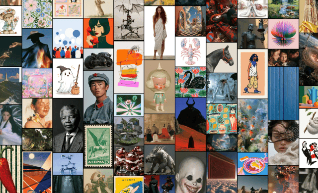

# Midjourney Mosaic

A living wall of Midjourney art for your Mac. Midjourney Mosaic fits portraits, landscapes, and squares into a responsive edge-to-edge waterfall, then turns over one tile at a time with the card-flip motion from Apple's classic Album Artwork screen saver.



[Download the latest release](https://github.com/zats/midjourney-mosaic/releases/latest)

## Install

1. Download `Midjourney-Mosaic-v0.1.0.zip` from the [latest release](https://github.com/zats/midjourney-mosaic/releases/latest).
2. Unzip it and double-click **Midjourney Mosaic.saver**.
3. Open **System Settings → Wallpaper → Screen Saver** and select **Midjourney Mosaic**.
4. Use **Options** to set the number of images and the pause between flips.

The first run needs an internet connection. Once an image has loaded successfully, the screen saver can reuse its local copy and falls back to stale cached images during CDN or network failures.

## Build it

Midjourney Mosaic requires macOS 14 or later, Xcode, and [XcodeGen](https://github.com/yonaskolb/XcodeGen).

```sh
brew install xcodegen
git clone https://github.com/zats/midjourney-mosaic.git
cd midjourney-mosaic
xcodegen generate
```

Build and test the preview app:

```sh
xcodebuild \
  -project MidjourneyMosaic.xcodeproj \
  -scheme MidjourneyMosaic \
  -destination 'platform=macOS' \
  test
```

Build a universal screen saver for Apple silicon and Intel Macs:

```sh
xcodebuild \
  -project MidjourneyMosaic.xcodeproj \
  -scheme MidjourneyScreenSaver \
  -configuration Release \
  -derivedDataPath build/ScreenSaverDerivedData \
  ARCHS='arm64 x86_64' \
  ONLY_ACTIVE_ARCH=NO \
  CODE_SIGNING_ALLOWED=NO \
  build

codesign --force --deep --sign - \
  'build/ScreenSaverDerivedData/Build/Products/Release/Midjourney Mosaic.saver'
```

The `.saver` bundle will be at `build/ScreenSaverDerivedData/Build/Products/Release/Midjourney Mosaic.saver`. The ad-hoc signature in the example is intended for local development; public distribution should use Developer ID signing and Apple notarization.

## Notes

Midjourney Mosaic is an independent, unofficial project and is not affiliated with or endorsed by Midjourney. Artwork, service names, and trademarks belong to their respective owners. The bundled feed is intentionally a static snapshot because Midjourney's Explore API is undocumented and may change without notice.
